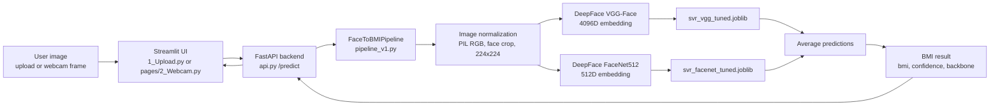
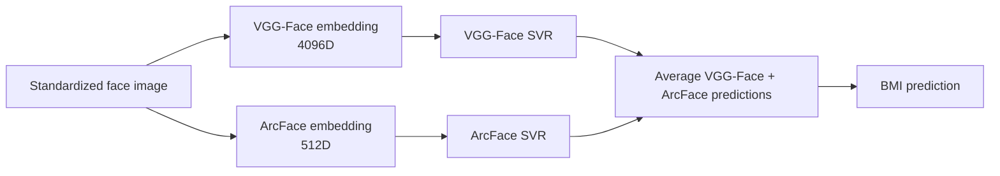

# End-to-End Inference Flow

Owner: Wade Chen (Role 1 - Team Lead & Integration)

Purpose: document how a user image moves through the application and becomes a BMI prediction. This document describes the current code path and the planned ArcFace upgrade separately.

## Current Demo Path

The current local demo path uses the existing `pipeline_v1.py` implementation. It loads VGG-Face and FaceNet SVR models from `models/beste/models/`.



Current result reproduced by `python pipeline_v1.py`:

| Path | Test rows | Overall r | Notes |
|---|---:|---:|---|
| VGG-Face SVR | 741 | 0.6261 | Loaded from local joblib |
| FaceNet512 SVR | 741 | 0.6144 | Loaded from local joblib |
| VGG-Face + FaceNet ensemble | 741 | 0.6469 | Current `pipeline_v1.py` default |

## Current Best Research Path

The current best reported experiment adds ArcFace features and drops the weaker FaceNet member from the ensemble.



Reported result from `models/beste/v4_arcface_ensemble.ipynb`:

| Path | Test rows | Overall r | Male r | Female r | MAE |
|---|---:|---:|---:|---:|---:|
| VGG-Face + ArcFace ensemble | 741 | 0.7180 | 0.7021 | 0.7438 | 4.6848 |

This path is not yet the local app's default because the ArcFace model artifact and ArcFace inference code are not currently present in `pipeline_v1.py`.

## API-Level Flow

The app has two UI entry points:

- `1_Upload.py`: image upload workflow.
- `pages/2_Webcam.py`: webcam capture workflow.

Both send image bytes to the backend:

```text
Streamlit UI -> POST /predict -> FaceToBMIPipeline.predict() -> JSON response
```

The backend response currently contains:

```json
{
  "bmi": 24.7,
  "confidence": 0.82,
  "bmi_category": "Normal weight",
  "backbone": "ensemble",
  "latency_ms": 118.3
}
```

## Integration Notes

- `api.py` is a FastAPI backend, even though some older docs still call it Flask.
- `client.py` and `test_api.py` appear to target an older API shape and should not be treated as the current demo path until updated.
- `src/inference_preprocess.py` provides a lighter preprocessing path for API uploads, but the current `api.py` calls `FaceToBMIPipeline` directly after decoding image bytes.
- When ArcFace artifacts become available locally, this flow chart should be updated and `pipeline_v1.py` should gain an ArcFace-backed option.
